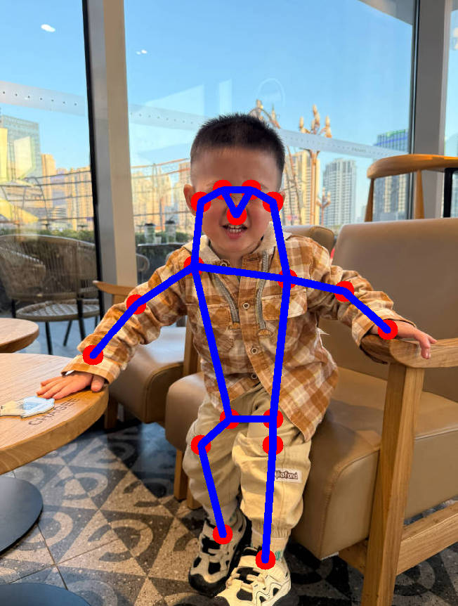

# AI Samples HRNetPose Estimation

## Overview

The `HRNetPose Estimation` sample enables the ability to perform accurate human pose estimation.
It captures the image input and publishes the result with the `/sample_hr_pose_estimation`.
For more information, please refer to [sample_hr_pose_estimation](https://github.qualcomm.com/QUIC-QRB-ROS/qrb_ros_samples/tree/jazzy/ai_vision/sample_hr_pose_estimation) .





## Pipeline flow for HRNetPose Estimation


## ROS Nodes Used in HRNetPose Estimation


| ROS Node         | Description                                                  |
| ---------------- | ------------------------------------------------------------ |
| `hrnet_pose_estimation_node` | Receive `/image_raw` topic, perform Pose detection on it, and publish `pose_estimation_results`topic. |
| `image_publisher_node` | image_publisher is a ros jazzy packages, can publish image ros topic with local path.For more detail,Please refer to [image_publisher](https://github.com/ros-perception/image_pipeline). |

## ROS Topics Used in HRNetPose Estimation


| ROS Topic | Type                         | Published By     |
| --------- | ---------------------------- | ---------------- |
| `/pose_estimation_results`  | `sensor_msgs.msg.Image` | `hrnet_pose_estimation_node` |
| `/image_raw` | `sensor_msgs.msg.Image` | `image_publisher_node` |

## Use cases on QCLINUX

### Prerequisites
- Please refer to [Settings](https://docs.qualcomm.com/bundle/publicresource/topics/80-70018-265/setup-host-env.html?vproduct=1601111740013072&version=1.4&facet=Qualcomm%20Intelligent%20Robotics%20Product%20(QIRP)%20SDK) to complete the device and host setup.


### On Host
**Step 1: Build sample project**

On the host machine, move to the artifacts directory and decompress the package using the `tar` command.

```bash
# Set up qir sdk environment
tar -zxf qirp-sdk_<qirp_version>.tar.gz
cd <qirp_decompressed_path>/qirp-sdk
source setup.sh

# build sample
cd <qirp_decompressed_path>/qirp-samples/ai_vision/sample_hr_pose_estimation
colcon build
```

**Step 2: Package and push sample to device**

```bash
# package and push build result of sample
cd <qirp_decompressed_path>/qirp-samples/ai_vision/sample_hr_pose_estimation/install/sample_hr_pose_estimation
tar -czvf sample_hr_pose_estimation.tar.gz lib share
scp sample_hr_pose_estimation.tar.gz root@[ip-addr]:/opt/
```

### On Device

To Login to the device, please use the command `ssh root@[ip-addr]`

**Step 1: Install sample package and model package**

```bash
# Remount the /usr directory with read-write permissions
(ssh) mount -o remount rw /usr

# Install sample package and model package
(ssh) tar --no-same-owner -zxf /opt/sample_hr_pose_estimation.tar.gz -C /usr/
```

**Step 2: Setup runtime environment**

```
# Set HOME variable
(ssh) export HOME=/opt

# set SELinux to permissive mode
(ssh) setenforce 0

# setup runtime environment
(ssh) source /usr/bin/ros_setup.sh && source /usr/share/qirp-setup.sh
```

**Step 3: Run sample**

```
# Launch the sample, You can replace 'image_path' with the path to your desired image.
ros2 launch sample_hr_pose_estimation launch_with_image_publisher.py image_path:=/usr/share/sample_hr_pose_estimation/input_image.jpg
```

If success, the log 

```
...
[sample_hr_pose_estimation-1] [INFO] [1742429725.487513553] [hrnet_pose_estimation_node]: Publisher pose_estimation_results image message
[sample_hr_pose_estimation-1] [INFO] [1742429725.492011678] [hrnet_pose_estimation_node]: Subscriber raw_image message
...
```

### On Host

```
source /opt/ros/jazzy/setup.bash
rqt
```

After startup `rqt`, Click the following button.

```
Plugins --> Visualization --> Image View
```

Then, select  `pose_estimation_results` to see the results.